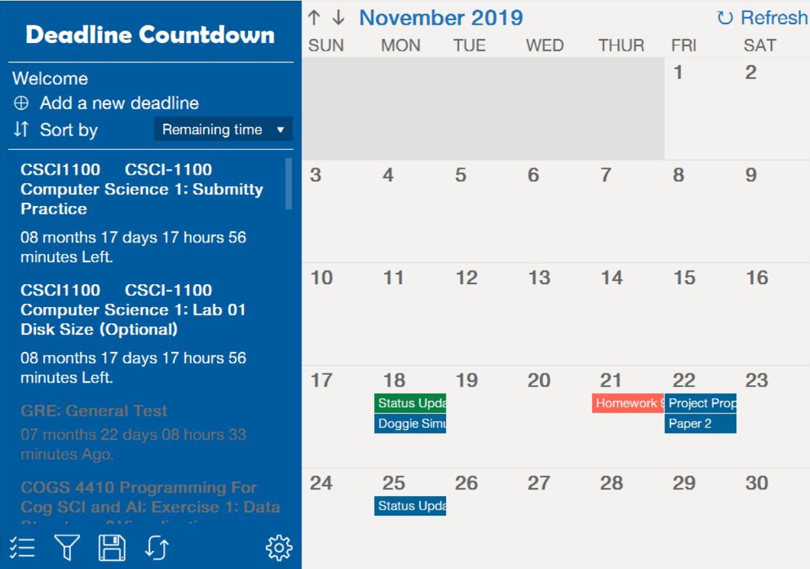
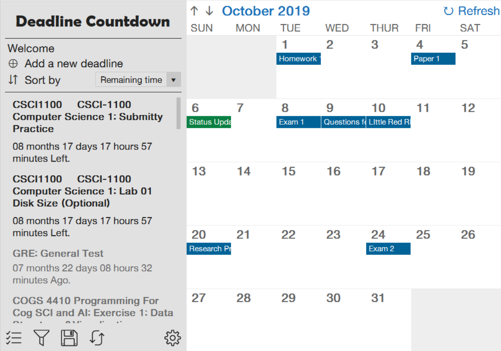
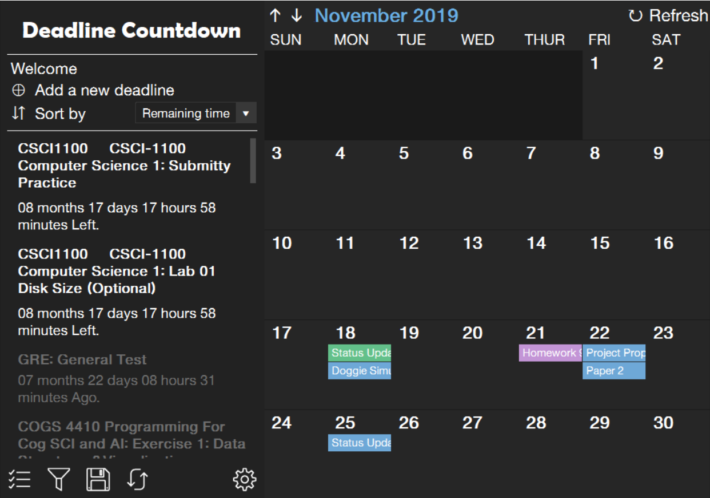
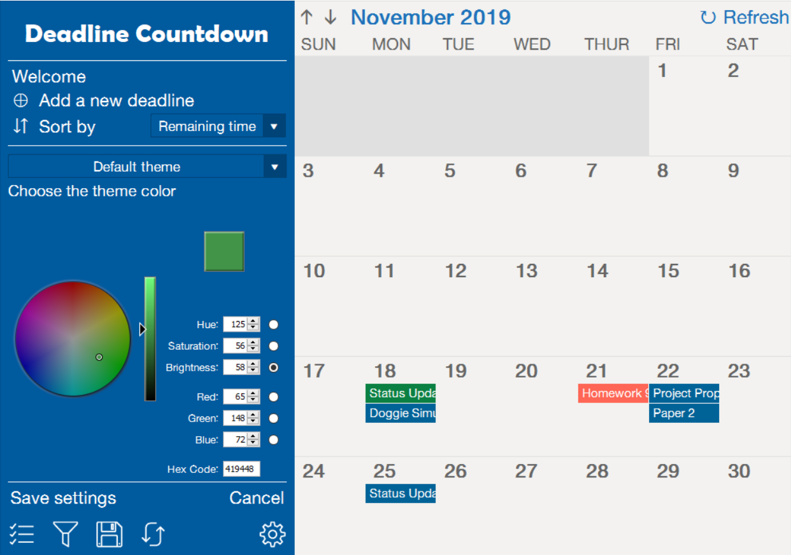

# DeadlineCountdown
An RCOS project

## About

 
Our software is a deadline management software that gathers all deadline information 
that are scattered on multiple homework submission webpages and shows all deadline 
information on a list and a calendar, helping users to visualize deadline information 
and thus memorize deadlines and manage time for study more efficiently. One of the 
most important function of this application is that it will notify the user through 
the system when the deadline approaches or changes. This feature can largely decrease 
the chance that a user misses his/her deadline and the probability that a user spends 
time on a deadline that no longer exists, so he/she can manage his/her schedule more 
efficiently.

## Features
- Automatically or manually adds deadlines and show those on a calendar
- Sends alarms when the deadlines is approaching (Notification)
- Shows the status beside the date
- Accesses the submission web page directly by double clicking the element
- Provides a countdown timer on Due Day which is really exciting
- Currently supports logging into RPI's homework submission server - [Submitty](https://submitty.cs.rpi.edu/) and 
  automatically retrieving deadline information

## Multiple themes
This program supports multiple themes
Light theme

Dark theme

Customizable theme

## Stay home
Due to COVID-19 situation, campus are now rely more on online servers - homeworks,
quizzes, exams... We've checked our program and made sure all current features are
functioning well. Hope our program can help with the experience of online courses.
Stay home and stay safe.

